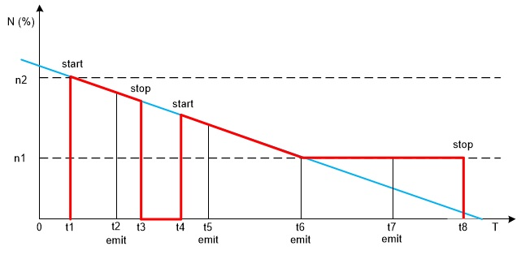


## Назначение смарт-контракта golos.emit

Смарт-контракт golos.emit обеспечивает генерацию новых токенов и их распределение по пулам вознаграждений в соответствии с его настройками — установленными значениями параметров.

## Общее
Смарт-контракт эмиссия генерирует свой актив по заданному алгоритму и распределяет его между смарт-контрактами вестинг, публикация, контроль и воркеры в соответствии со значениями, прописанными в настройках смарт-контракта эмиссии. Полученная каждым из этих смарт-контрактов часть актива помещается в их собственный пул и расходуется в виде вознаграждений. Средства из пула вестинга начисляются держателям вестинга, из пула публикации — авторам публикаций, из пула воркеров — воркерам.  

## Параметры, устанавливаемые в смарт-контракте golos.emit
```cpp
emit_param, types:[
    struct inflation_rate {
        uint16_t start,
        uint16_t stop,
        uint32_t narrowing
    },
    struct reward_pools {
        name name,
        uint16_t percent
    },
    struct emit_token {
        symbol symbol
    },
    struct emit_interval {
        uint16_t value
    },
]
```
Параметры:  
`inflation_rate` — параметры инфляции, определяющие количество новых токенов, выпускаемых за определенный период времени. Токены, уже находящиеся в обращении, при вычислении этого показателя не учитываются. Значение `inflation_rate` является структурой, содержащей поля: 
  * `start` — начальный процент инфляции;  
  * `stop` — минимальный показатель инфляции;  
  * `narrowing` — Скорость уменьшения текущего процента инфляции (показывает, за сколько секунд значение инфляции `start` уменьшится на 0.01 %);  

`reward_pools` — вектор пулов вознаграждений. Для каждого пула значение параметра имеет вид структуры, содержащей поля:  
  * `name` — имя пула вознаграждения;  
  * `percent` — процент от эмиссии (от суммы новых выпущенных в обращение) токенов, переводимый в пул `name`. Процент от эмиссии задается с точностью до 0,01 процента. Для этого параметр должен принимать значения от 0 до 10000;  

`emit_token` — вид токена, эмиссия которого выполняется:  
  * `symbol` — символ токена;  

`emit_interval` — параметр интервала эмиссии:  
  * `value` — интервал эмиссии новых токенов (в секундах).  

Выпускаемые токены распределяются среди нескольких пулов. Пулы вознаграждения, которые будут пополняться новыми токенами, определяются делегатами приложения. Один из пулов вознаграждений должен иметь нулевой процент. В этот пул перечисляется остаток токенов, нераспределенных по другим пулам.  

При снижении инфляции до минимального ее показателя `stop` эмиссия токенов продолжается, но при этом остается неизменной.  

Ограничения:  
Суммарный процент всех распределенных по пулам токенов должен быть не более 100 (или 10 000 токенов). Например, 25 (пул вестинг) + 25 (пул публикаций) + 49 (пул воркеров) + 0 (пул управления) = 99 (%) .

## Операции-действия, применяемые в смарт-контракте golos.emit
В смарт-контракте `golos.emit` реализованы следующие операции-действия: [setparams](#operaciya-deistvie-setparams), [validateprms](#operaciya-deistvie-validateprms), [start](#operaciya-deistvie-start), [stop](#operaciya-deistvie-stop), [emit](#operaciya-deistvie-emit).  

## Операция-действие setparams
Операция-действие `setparams` используется для установки (конфигурирования) параметров смарт-контракта. Операция-действие имеет вид:

```cpp
void emission::setparams(vector<emit_param> params)
```

## Операция-действие validateprms
Операция-действие `validateprms` вызывается смарт-контрактом и используется для проверки параметров на валидность, контролирует наличие в них ошибок.  
```cpp
void emission::validateprms(vector<emit_param> params)
```

## Операция-действие start
Операция-действие `start` используется для запуска процесса эмиссии токенов определенного вида в соответствии с выбранным алгоритмом.  
Операция-действие имеет следующий вид:
```cpp
void emission::start()
```
Запуск операции-действия `start` требует авторизации смарт-контракта эмиссии.  
Время начала эмиссии определяется моментом первого вызова `start`. Вызов операции-действия `start` требует, чтобы предварительно были настроены параметры смарт-контракта, а также пулы вознаграждения.  

## Операция-действие stop
Операция-действие `stop` используется для временного или полного останова процесса эмиссии токенов, вызванного разными причинами, в том числе необходимостью изменить параметры смарт-контракта (например, для перенастройки пулов вознаграждений). Операция-действие имеет следующий вид:
```cpp
void emission::stop() 
```
Запуск операции-действия `stop` требует авторизации смарт-контракта эмиссии.

## Операция-действие emit
Операция-действие `emit` является внутренней и ее вызов недоступен для пользователя. Используется для выпуска токенов в количестве, определяемом выбранным алгоритмом. Операция-действие имеет следующий вид:  
```cpp
void emission::emit() 
```

Операция-действие `emit` вызывается периодически через равные интервалы времени. С каждым ее вызовом определяется количество средств для начисления по каждому пулу вознаграждения. 

На рис.1 приведена диаграмма, демонстрирующая выпуск токенов смарт-контрактом эмиссии на фоне инфляции и вызовов операций-действий `start`, `stop` и `emit`.  



Рис.1 — Диаграмма выпуска токенов смарт-контрактом эмиссия  

На диаграмме по вертикали отображается годовой процент выпускаемых новых токенов определенного вида по отношению к их общему количеству данного вида. По горизонтали отображается время. Синей линией условно показана годовая инфляция токенов данного вида. Красной линией условно выделен процент выпускаемых токенов данного вида смарт-контрактом эмиссия по отношению к общему количеству этого вида токенов.  

Обозначения на диаграмме рис.1:  
n1 — минимальный показатель инфляции, устанавливается параметром `stop`;  
n2  — начальный показатель инфляции, устанавливается параметром `start`;  
t1 и t4  — моменты времени запуска операции-действия `start`;  
t3 и t8  — моменты времени запуска операции-действия `stop`;  
t2, t5, t6 и t7  — моменты времени запуска операции-действия `emit`.  

Диаграмма показывает, что выпуск токенов начался после первого запуска операции-действия `start`. После запусков операции-действия `stop` выпуск токенов прекращался. При достижении порогового значения n1 выпуск токенов оставался на минимально допустимом уровне. Запуском операции-действия `emit` определялось количество выпущенных токенов, которое необходимо было распределять по пулам вознаграждений смарт-контрактов.  
